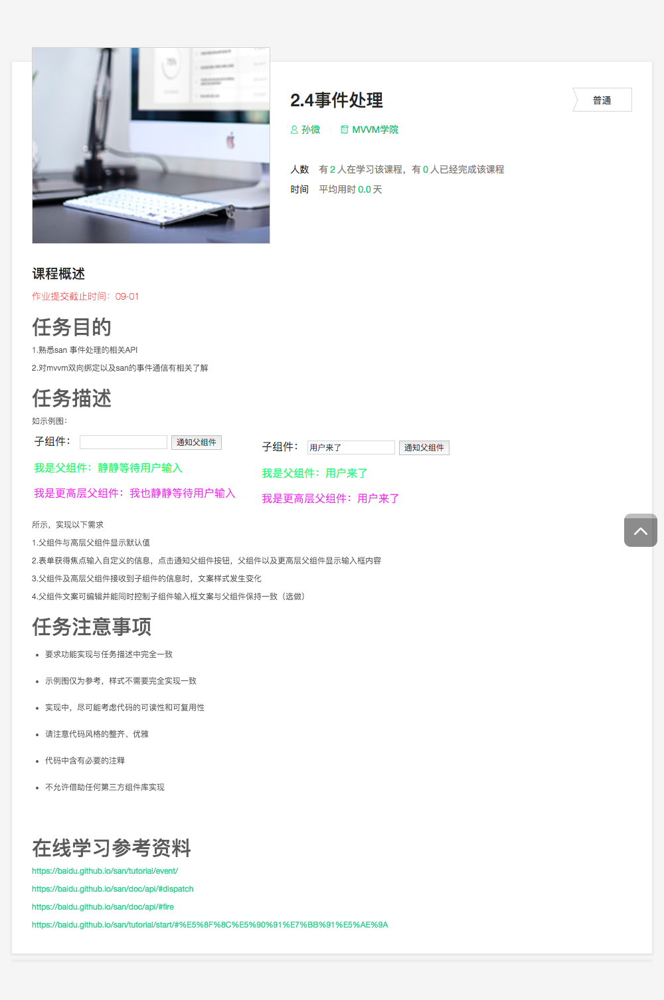

## 2.3 样式控制

### 学习要点

* san 框架：CSS 样式控制、点击事件

### 相关链接

* [Webpack 中文官方文档](https://doc.webpack-china.org/)
* [Parcel 中文官方文档](https://zh.parceljs.org/)
* [San 官方文档](https://baidu.github.io/san/)

### 课程详情

