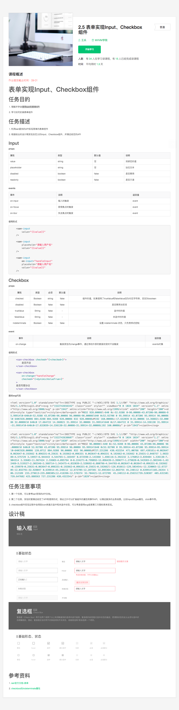

## 2.5 表单实现 Input、Checkbox 组件

### 学习要点

* san 框架：使用 san 的表单 API、学习封装

### 相关链接

* [Webpack 中文官方文档](https://doc.webpack-china.org/)
* [Parcel 中文官方文档](https://zh.parceljs.org/)
* [San 官方文档](https://baidu.github.io/san/)

### 课程详情

